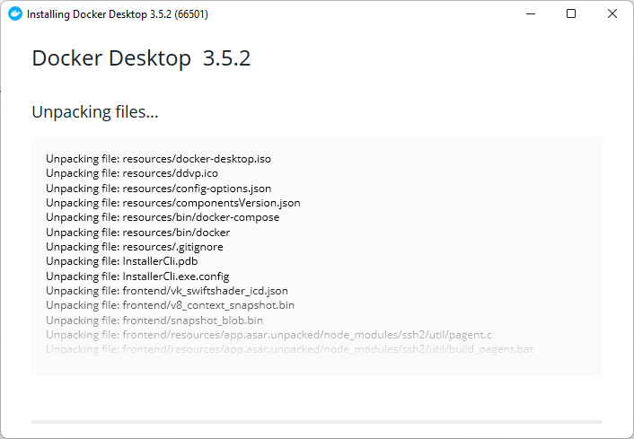

# Установка и настройка WSL 2 и Docker в Windows 10

## Терминал Windows

В целом, устанавливать его не нужно, но так будет удобнее при начальных этапах настройки. Терминал Windows можно
установить из [Microsoft Store](https://aka.ms/terminal). Прочитать подробнее
можно [здесь](https://docs.microsoft.com/ru-ru/windows/terminal/get-started)

## Установка WSL

### Установка WSL 1

Запустите терминал правами администратора и откройте оболочку `PowerShell`


Выполните следующую команду

```shell
dism.exe /online /enable-feature /featurename:Microsoft-Windows-Subsystem-Linux /all /norestart
```


### Обновление до WSL 2

Выполните следующую команду

```shell
dism.exe /online /enable-feature /featurename:VirtualMachinePlatform /all /norestart
```

Установка версии по умолчанию

```shell
wsl --set-default-version 2
```


Установка версии для конкретного дистрибутива

```shell
 wsl --set-version Ubuntu-20.04 1
```

### Установка дистрибутива

Откройте [Microsoft Store](https://aka.ms/wslstore) и выберите предпочтительный дистрибутив Linux. Напишите в
поиске `Ubuntu` и выберите один из вариантов:


Запустите установленный дистрибутив, введите логин и пароль


После этого можно продолжить работать в нем или в терминале Windows

## Настройка окружения WSL

### Установка Node.js

Выполните следующие команды

```shell
curl -fsSL https://deb.nodesource.com/setup_lts.x | sudo -E bash -
sudo apt-get install -y nodejs
sudo apt install build-essential
```

Проверка установки

```shell
node -v
```


## Docker

### Установка

Скачайте и установите докер с [официального сайта](https://www.docker.com/products/docker-desktop)


Запустите `Docker Desktop` и перейдите в настройки. Убедитесь, что включен флажок `Use the WSL 2 based engine`


Если все верно сделано на этапе установке дистрибутива ubuntu, то он появится в списке на
вкладке `Resources > WSL Integration`. Активируйте его и сохраните настройки


Лучше всего после этого перезагрузить компьютер и дождаться полного включения докера

### Проверка

Для проверки доступности, откройте дистрибутив ubuntu и выполните команды

```shell
docker --version 
```


Выполните следующую команду для запуска тестового контейнера

```shell
docker run hello-world
```


В случае успеха, вы увидите такое сообщение:


## Финал 
На этом настройка закончена, приятного кодинга =)
